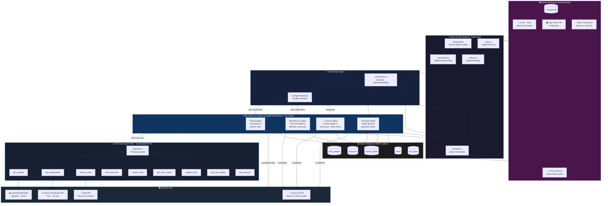
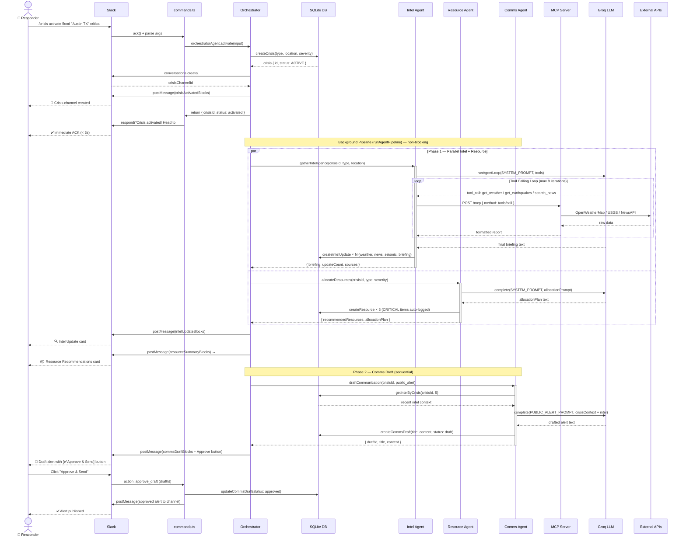
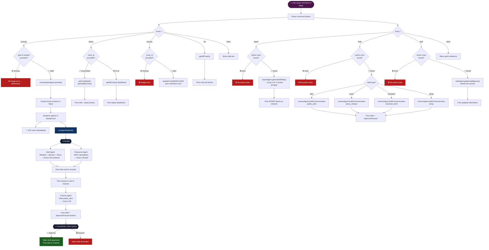

# 🚨 ResQ AI — Multi-Agent Crisis Response Coordinator for Slack

[](https://slack.com)
[](https://modelcontextprotocol.io)
[](https://groq.com)
[](https://devpost.com)

> **Slack Agent Builder Challenge 2025 — Agent for Good Track**  
> Empowering nonprofit and government emergency response teams with AI-orchestrated crisis coordination inside Slack.

---

## 🎯 What It Does

ResQ AI transforms Slack into a real-time crisis command center. When disaster strikes — floods, wildfires, earthquakes — responders no longer waste critical time hunting for information across scattered tools.

**In one command, ResQ AI:**
- 🔍 Gathers live weather, seismic, and news intelligence (via MCP + real APIs)
- 📦 Recommends and tracks resource allocation (WHO-standard calculations)
- 📢 Drafts public alerts, press releases, and volunteer briefings (Groq LLM)
- 📋 Generates military-style SITREPs on demand
- 🤖 Orchestrates 5 specialized AI agents via the Google A2A protocol

---

## 🏗️ Architecture

### System Architecture



---

### 🔄 Crisis Activation Data Flow



---

### 🗂️ Command & Decision Flowchart



### Technology Stack

| Component | Technology |
|---|---|
| Slack Framework | `@slack/bolt` v4 (Socket Mode) |
| LLM | Groq API (`llama-3.3-70b-versatile`) |
| MCP SDK | `@modelcontextprotocol/sdk` v1.12 |
| A2A Protocol | Google A2A spec (HTTP JSON-RPC) |
| Real-Time Search | NewsAPI + OpenWeatherMap + USGS |
| Database | SQLite (better-sqlite3) |
| Language | TypeScript / Node.js |

---

## 🚀 Setup & Installation

### Prerequisites
- Node.js 18+
- A Slack workspace with admin access
- Groq API key (free at [console.groq.com](https://console.groq.com))

### 1. Install Dependencies

```bash
cd slack
npm install
```

### 2. Create Slack App

1. Go to [api.slack.com/apps](https://api.slack.com/apps) → **Create New App** → **From scratch**
2. Name: `ResQ AI`, select your workspace

**Enable Socket Mode:**
- Settings → Socket Mode → Enable
- Generate an **App-Level Token** with `connections:write` scope
- Copy the `xapp-...` token → `SLACK_APP_TOKEN`

**Bot Token Scopes** (OAuth & Permissions):
```
channels:manage    channels:read      channels:write
chat:write         commands           app_mentions:read
im:write           users:read
```

**Slash Commands** (Slash Commands → Create):
- `/crisis` → Request URL: (handled via Socket Mode)
- `/resq` → Request URL: (handled via Socket Mode)

**Event Subscriptions** (Socket Mode handles this):
- `app_home_opened`
- `app_mention`

**Install the app** to your workspace → copy `Bot User OAuth Token` → `SLACK_BOT_TOKEN`

### 3. Configure Environment

```bash
cp .env.example .env
```

Edit `.env`:
```env
SLACK_BOT_TOKEN=xoxb-...        # From OAuth & Permissions
SLACK_SIGNING_SECRET=...         # From Basic Information
SLACK_APP_TOKEN=xapp-...         # From Socket Mode

GROQ_API_KEY=gsk_...             # From console.groq.com (free)

# Optional — app works with mock data without these:
OPENWEATHER_API_KEY=...          # openweathermap.org (free tier)
NEWS_API_KEY=...                 # newsapi.org (free tier)
```

### 4. Run the App

```bash
npm run dev
```

You should see:
```
🚨 Starting ResQ AI — Multi-Agent Crisis Response Coordinator
✅  ResQ AI is live! (Socket Mode — no public URL needed)
🔧 MCP Server running on http://localhost:3001/mcp
🤖 A2A server running on http://localhost:3002/a2a
```

---

## 💬 Usage

### Activate a Crisis Response

```
/crisis activate flood "Austin TX" high
/crisis activate wildfire "Los Angeles CA" critical
/crisis activate earthquake "Kathmandu Nepal" critical
```

ResQ AI will automatically:
1. Create a dedicated `#crisis-flood-austin-tx` channel
2. Dispatch Intel Agent → fetches weather, seismic data, news
3. Dispatch Resource Agent → recommends resources (WHO standards)
4. Post Comms Agent's draft public alert for 1-click approval

### Generate a Situation Report

```
/resq report              # Uses most recent active crisis
/resq report <crisis_id>  # Specific crisis
```

### Draft Communications

```
/resq draft alert          # Public safety alert
/resq draft press          # Press release
/resq draft volunteer      # Volunteer briefing
/resq draft sitrep         # Military-style SITREP
```

### Other Commands

```
/crisis status             # Dashboard of all crises
/crisis resolve <id>       # Mark crisis resolved
/resq intel                # Refresh live intelligence
```

---

## 🤖 Agent Details

### Orchestrator Agent
Master coordinator. Receives activation request, creates crisis record, auto-creates Slack channel, dispatches sub-agents in parallel via A2A, then posts results back to Slack.

### Intel Agent
Gathers live situational intelligence using a Groq tool-calling loop:
- **Weather**: OpenWeatherMap (or mock) — conditions, alerts
- **Seismic**: USGS Earthquake API (free, no key needed) — recent activity
- **News**: NewsAPI (or mock) — latest crisis coverage
- Synthesizes a briefing using LLM and saves all updates to DB

### Resource Agent
Evidence-based resource allocation:
- Calculates requirements from severity/population (WHO standards)
- Crisis-type-specific items (rescue boats for floods, N95 for wildfires)
- Auto-logs CRITICAL items to the DB inventory
- Tracks: volunteers, vehicles, shelters, medical, food, water

### Comms Agent
Generates 4 document types using crisis context + stored intel:
- **Public Alert** — simple language, imperative verbs, immediate actions
- **Press Release** — AP style, factual, for media distribution
- **Volunteer Briefing** — operational instructions, safety, chain of command
- **SITREP** — military format (Situation/Mission/Execution/Logistics/C2)

### Report Agent
On-demand SITREP generation aggregating all DB data:
- Pulls all intel updates, resource inventory, comms drafts
- Generates structured 7-section SITREP via Groq
- Includes metrics: hours active, resources tracked, intel count

---

## 🔧 MCP Server Tools

The MCP server (`src/mcp/server.ts`) exposes 9 tools:

| Tool | Description | API |
|---|---|---|
| `get_weather` | Current conditions + alerts | OpenWeatherMap |
| `get_earthquakes` | Recent seismic activity | USGS (free) |
| `search_news` | Crisis-relevant articles | NewsAPI |
| `find_resources` | Query resource inventory | SQLite |
| `create_crisis` | Create crisis record | SQLite |
| `get_crisis_status` | Crisis details by ID | SQLite |
| `update_crisis` | Update status/severity | SQLite |
| `log_intel_update` | Save intelligence update | SQLite |
| `log_resource` | Add resource to inventory | SQLite |

Test the MCP server directly:
```bash
curl -X POST http://localhost:3001/mcp \
  -H "Content-Type: application/json" \
  -d '{"jsonrpc":"2.0","method":"tools/call","id":1,"params":{"name":"get_earthquakes","arguments":{"location":"California"}}}'
```

---

## 🤝 A2A Protocol

Agent-to-Agent communication follows the [Google A2A specification](https://google.github.io/A2A/).

**Agent Cards** available at:
- `GET http://localhost:3002/.well-known/agent.json` — Orchestrator card
- `GET http://localhost:3002/a2a/{intel|resource|comms|report}` — Sub-agent cards

**Send a task to an agent:**
```bash
curl -X POST http://localhost:3002/a2a/intel \
  -H "Content-Type: application/json" \
  -d '{
    "jsonrpc": "2.0",
    "method": "tasks/send",
    "id": "test-1",
    "params": {
      "skill": "gather_intel",
      "message": {
        "role": "user",
        "parts": [{"type": "text", "text": "{\"crisisId\":\"test\",\"crisisType\":\"flood\",\"location\":\"Austin TX\",\"severity\":\"high\"}"}]
      }
    }
  }'
```

---

## 📁 Project Structure

```
slack/
├── src/
│   ├── app.ts                    # Main entrypoint (Bolt + Express + MCP)
│   ├── config.ts                 # Environment configuration
│   ├── agents/
│   │   ├── orchestrator.ts       # Master coordinator
│   │   ├── intel-agent.ts        # Intelligence gathering
│   │   ├── resource-agent.ts     # Resource allocation
│   │   ├── comms-agent.ts        # Communications drafting
│   │   └── report-agent.ts       # SITREP generation
│   ├── mcp/
│   │   ├── server.ts             # MCP HTTP server (9 tools)
│   │   └── tools/
│   │       ├── get-weather.ts    # OpenWeatherMap integration
│   │       ├── get-earthquakes.ts# USGS free API
│   │       ├── search-news.ts    # NewsAPI integration
│   │       └── find-resources.ts # DB resource queries
│   ├── a2a/
│   │   ├── agent-card.ts         # A2A spec agent cards
│   │   ├── client.ts             # HTTP task sender
│   │   └── server.ts             # JSON-RPC router
│   ├── slack/
│   │   ├── commands.ts           # /crisis + /resq handlers
│   │   ├── actions.ts            # Block Kit button handlers
│   │   └── views.ts              # Modal + event handlers
│   ├── db/
│   │   ├── schema.ts             # SQLite schema + init
│   │   └── queries.ts            # CRUD operations
│   └── utils/
│       ├── llm.ts                # Groq client + agent loop
│       └── formatter.ts          # Slack Block Kit builders
├── .env.example
├── package.json
├── tsconfig.json
└── README.md
```


---

## 🌍 Social Impact

ResQ AI directly addresses the **coordination failures** that cost lives in disasters:

- **2011 Japan Earthquake**: 1,600+ people died in evacuation-related incidents due to poor coordination
- **2018 Camp Fire (CA)**: Delayed evacuation orders from fragmented communication systems
- **COVID-19 PPE Crisis**: States bidding against each other due to no unified resource visibility

ResQ AI gives nonprofits and local governments the same AI-powered coordination that enterprise companies have — for free, inside the tools they already use.

**Target users**: Red Cross chapters, FEMA field offices, local EOCs, NGOs, hospital networks

---

## 📄 License

MIT — Built for the Slack Agent Builder Challenge 2025
